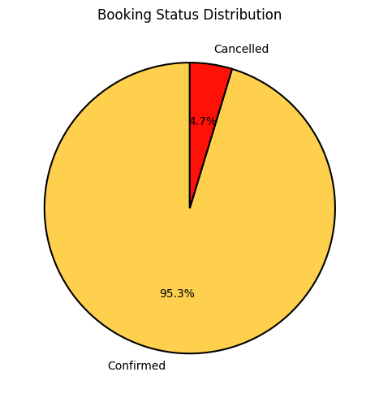
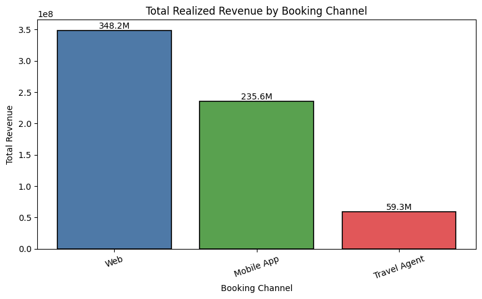
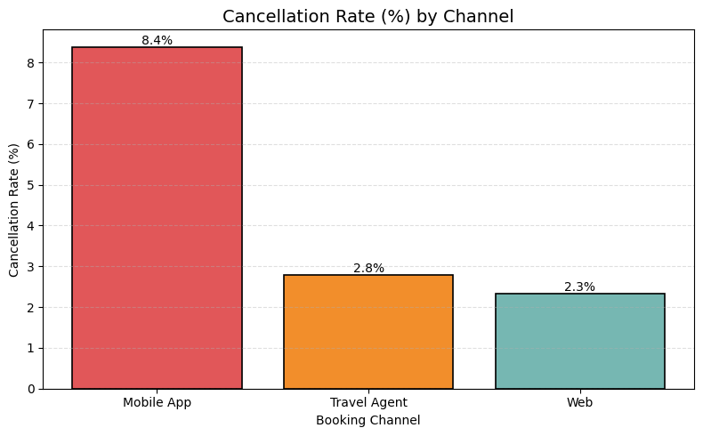
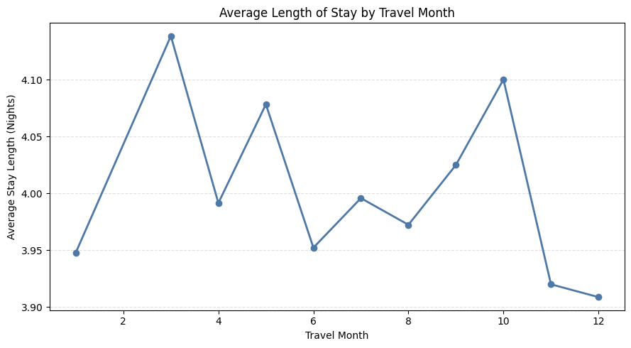
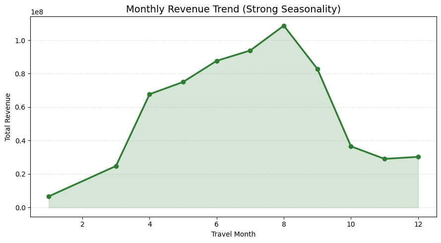

# 📊 Hotel Booking Performance & Revenue Optimization  
### Channel, Cancellation & Revenue Optimization Case Study

**Author:** Hemang Krish  
**Tools Used:** Python (Pandas, NumPy), Matplotlib  
**Dataset Size:** ~30,000 hotel booking records  

---

## 🧠 Business Objective

Hotel booking platforms face revenue leakage due to:

- Customer cancellations  
- Channel-level booking quality differences  
- Seasonal revenue concentration  
- Operational funnel inefficiencies  

This case study analyzes booking behavior to identify revenue risks and provide structured business recommendations.

---

## 📦 Dataset Overview

- ~30,000 raw bookings  
- ~22,700 valid bookings analyzed  
- Fields include:
  - Booking Channel  
  - Booking Status  
  - Cost & Selling Price  
  - Check-in / Check-out Dates  
  - Hotel Star Rating  
  - Room Type  

---

## 🛠 Methodology

### 1️⃣ Data Cleaning
- Removed failed bookings for behavioral analysis  
- Validated pricing and lifecycle fields  
- Handled expected null values for cancelled bookings  

### 2️⃣ Feature Engineering
Derived:
- Cancellation Indicator  
- Lead Time  
- Length of Stay  
- Travel Month  
- Profit (Selling Price – Cost Price)  

### 3️⃣ Exploratory & Root Cause Analysis
- Channel-wise booking reliability  
- Cancellation propensity by lead time  
- Property and room segment behavior  
- Revenue seasonality patterns  
- Funnel leakage analysis  

---

## 📈 Key Business Metrics

| Metric | Value |
|--------|-------|
| Total Bookings Analyzed | ~22,700 |
| Overall Cancellation Rate | ~4.7% |
| Total Realized Revenue | ~₹650M |
| Total Profit | ~₹156M |
| Avg Length of Stay | ~4 nights |

---

## 📊 Key Visual Insights

### Booking Status Distribution

---

### Revenue by Channel

---

### Cancellation Share by Channel

---

### Lead Time & Cancellation Behavior

---

### Monthly Revenue Trend (Seasonality)

---

## 🔍 Major Insights

### 1️⃣ Channel Quality Difference
- Web channel → Lowest cancellation (~2.3%)  
- Mobile App → Highest cancellation (~8.4%)  
- Channel choice strongly impacts revenue realization  

### 2️⃣ Lead-Time Risk
Longer lead times slightly increase cancellation propensity.

### 3️⃣ Revenue Seasonality
Revenue fluctuates significantly across months despite stable booking volume, indicating pricing and demand-mix sensitivity.

### 4️⃣ Funnel Leakage
Failed bookings highlight operational inefficiencies before confirmation stage.

---

## 💡 Business Recommendations

- Prioritize Web channel scaling (highest reliability & profit contribution)
- Introduce commitment mechanisms in Mobile App bookings
- Maintain Travel Agent channel selectively
- Focus on retention and confirmation assurance over aggressive discounting

---

## 📁 Repository Structure

hotel_bookings_case_study/
│
├── report/ # Final business report (PDF)
├── visuals/ # Generated analysis charts
├── hotel_analysis.ipynb # Full exploratory & business analysis
├── Hotels Booking Data (1).csv
├── LICENSE
└── README.md

---

## 🚀 Business Value Demonstrated

✔ Root Cause Analysis (RCA)  
✔ Revenue Risk Identification  
✔ Channel Optimization Strategy  
✔ Data-to-Decision Translation  
✔ Structured Business Thinking  

---

## 👤 About Me

Hemang Krish  
Business Analysis | Data Strategy | Revenue Optimization  
B.Tech Computer Engineering, DTU  

---

## 🚀 Business Value Demonstrated

✔ Root Cause Analysis (RCA)  
✔ Revenue Risk Identification  
✔ Channel Optimization Strategy  
✔ Data-to-Decision Translation  
✔ Structured Business Thinking  

---

## 👤 About Me

Hemang Krish  
Business Analysis | Data Strategy | Revenue Optimization  
B.Tech Computer Engineering, DTU  

---

## 🚀 Business Value Demonstrated

✔ Root Cause Analysis (RCA)  
✔ Revenue Risk Identification  
✔ Channel Optimization Strategy  
✔ Data-to-Decision Translation  
✔ Structured Business Thinking  

---

## 👤 About Me

Hemang Krish  
Business Analysis | Data Strategy | Revenue Optimization  
B.Tech Computer Engineering, DTU  

MIT License

Copyright (c) 2026 Hemang Krish
